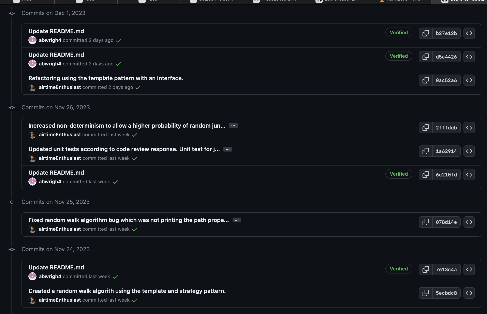
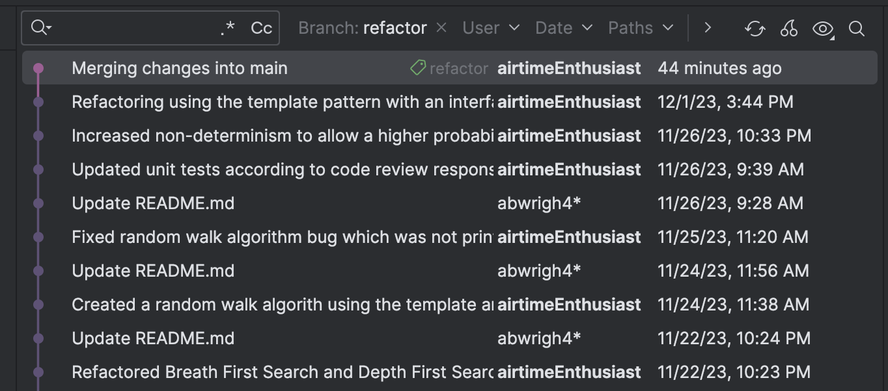
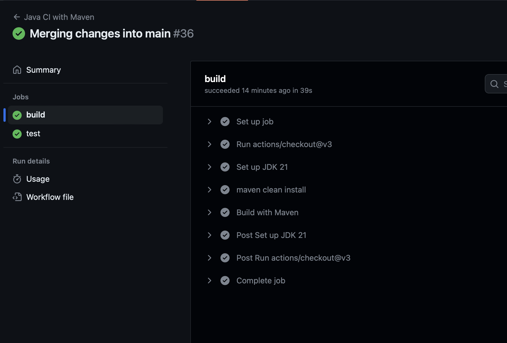

# GraphViz Designer
GraphViz Designer is a sophisticated program designed to facilitate comprehensive testing of functions within the graphviz-java library.

### Commits 


### Merge


### Workflow



## Example Directed Graph
```
digraph{
    "a" -> "c"
    "a" -> "z"
    "z" -> "x"
    "z" -> "y"
    "a" -> "b"
    "b" -> "d"
    "d" -> "f"
}
```

### Feature 1
Parse a DOT graph file to create a graph 
#### Accept A DOT Graph
```
@Test
public void setup(){
        String pathName = "example/digraph_simple.dot";
        g = new parseGraph(pathName);
    }
```
### Output Graph
```
public void testOutputGraph(){
        String pathName = "example/dotted-edge.dot";
        parseGraph g = new parseGraph(pathName);
        g.outputGraph(pathName);
    }
```
#### Adding a list of nodes
```
@Test
 public void testAddNodes(){
        String[] labels = {"a", "b", "z"};
        g.addNodes(labels);
    }
```

### Adding edges
```
@Test
public void testAddEdges(){
        g.addEdge("a","c");
    }
```
#### Output Graph
```
@Test
public void testOutputGraph(){
        String pathName = "example/dotted-edge.dot";
        parseGraph g = new parseGraph(pathName);
        g.outputGraph(pathName);
    }
```
#### Output graph into a DOT file
```
@Test
    public void testDOTGraph(){
        g.outputDOTGraph("example/color.dot");
    }
```

#### Remove nodes
```
    @Test
    public void testRemoveNodes(){
        int sizeBefore = g.getNodeCount();
        System.out.println(g.toString());
        String[] labels = {"a", "b"};
        g.removeNodes(labels);
        int sizeAfter = g.getNodeCount();
        System.out.println(g.toString());
        Assert.assertEquals(sizeBefore - 2, sizeAfter);
    }
```
### Feature 2

#### Remove an edge
```
    @Test
    public void testRemoveEdge(){
        int sizeBefore = g.getEdgeCount();
        System.out.println(g.toString());
        g.removeEdge("c", "b");
        //System.out.println(g.toString());
    }
```

#### Breath First Search
```
 @Test
    public void testBFSTraversal() {
        GraphVizSearch newPath = new GraphVizSearch(g.mutGraph);
        MutableNode srcNode = newPath.findNode("a");
        MutableNode dstNode = newPath.findNode("b");
        String expectedBFS = "a->c->z->b";
        newPath.GraphSearch(srcNode,dstNode,Algorithm.BFS);
        String actualBFS = newPath.printListPath();
        Assert.assertEquals(expectedBFS, actualBFS);
    }
```

#### Depth First Search
```
@Test
    public void testDFSTraversal() {
        GraphVizSearch newPath = new GraphVizSearch(g.mutGraph);
        MutableNode srcNode = newPath.findNode("a");
        MutableNode dstNode = newPath.findNode("b");
        String expectedBFS = "a->b";
        newPath.GraphSearch(srcNode,dstNode, Algorithm.DFS);
        String actualBFS = newPath.pathToString();
        Assert.assertEquals(expectedBFS,actualBFS);
    }
```

#### Check for non-existant node
```
    @Test
    public void testPathNotFoundTraversal() {
        GraphVizSearch newPath = new GraphVizSearch(g.mutGraph);
        MutableNode srcNode = newPath.findNode("a");
        MutableNode dstNode = newPath.findNode("o");
        String expectedBFS = "a->b";
        newPath.GraphSearch(srcNode,dstNode,Algorithm.BFS);
        String actualBFS = newPath.pathToString();
        Assert.assertNotEquals(actualBFS,expectedBFS);
    }
```


